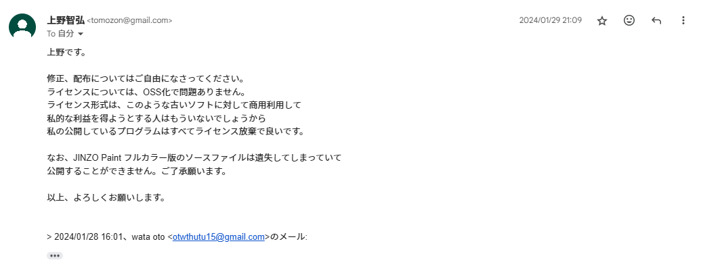

# Minute Mascot


Minute Mascot displays a mascot charactor on your Windows CE device. You can easily make your own mascot data.

画面に、マスコットを表示します.......それだけです。データをユーザが作成することも可能です。

Official Readme: [JA](readme.txt) / [EN](readme-e.txt)

## License

This software is distributed here under the [MIT License](LICENSE), with the permission of the original author [Tomohiro Ueno](http://www.tomozon.sakura.ne.jp/wince/), expressed in the following e-mail reply.

本ソフトウェアは、作者である[上野智弘](http://www.tomozon.sakura.ne.jp/wince/)様から電子メールでの許諾を得た上で、[MIT License](LICENSE) の下で配布しています。以下に実際の文面を記します。



```
上野です。

修正、配布についてはご自由になさってください。
ライセンスについては、OSS化で問題ありません。
ライセンス形式は、このような古いソフトに対して商用利用して
私的な利益を得ようとする人はもういないでしょうから
私の公開しているプログラムはすべてライセンス放棄で良いです。

なお、JINZO Paint フルカラー版のソースファイルは遺失してしまっていて
公開することができません。ご了承願います。

以上、よろしくお願いします。
```
